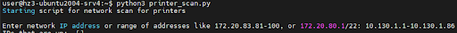
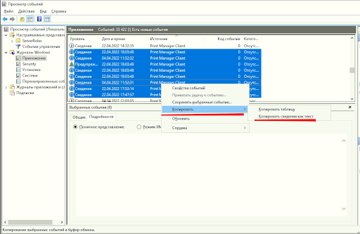

# Обращение в техническую поддержку

Для получения качественной и быстрой помощи в обращении необходимо указать: версии всех компонентов системы (Мониторинг, ПринтМененджера, клиента ПМ) и собрать логи. 

## Определение номера версии Мониторинга и ПринтМененджера

В терминале сервера введите команды:




cat /opt/printum/.version





cat /opt/printmanager/.version





## Определение версии клиента ПМ

1. Перейдите в папку с клиентом ПМ : C:\Program Files\printum\printmanager_client\
2. Откройте свойства файла as_service.exe
3. Перейдите во вкладку “Подробно”. В графе “Версия файла” указана версия программы.

    

## Работа с логами
Для отправки понадобятся логи всех компонентов системы участвующих в проблеме. 

### Сбор логов Мониторинга и ПринтМененджера

Сбор логов по запросу технической поддержки Принтум.

Для сбора логов по установленной системе введите команды, указанные ниже.

Если установлен Мониторинг и ПринтМенеджер или только Мониторинг:
    bash /opt/printum/logs.sh

Если установлен только ПринтМенеджер:
    bash /opt/printmanager/logs.sh

После запуска команды вы увидите процесс сбора логов, который завершится сообщением типа:

Логи успешно собраны и сохранены в
 /путь к папке/ALL_LOGS/logs-2023-12-06-17-14-44.tar.gz

Логи будут лежать в папке ALL_LOGS в архиве с датой и временем.
При многократном запуске команды будут формироваться новые архивы.

В системе можно настроить логирование в Loki. Для этого обратитесь к разделу “Настройка логирования в Loki “

### Сбор логов установки клиента ПМ

При установке клиента ПринтМененджера создается три лога:

+ install.log — в папке запуска команды.
+ service_install_time_date.log — В папке C:\Program Files\printum\ .
+ driver_install_time_date.log — В папке C:\Program Files\printum\

### Сбор логов работы клиента ПМ

1. Нажмите комбинацию клавиш Win+R и в появившемся окне введите “eventvwr”.
2. Откроется окно Просмотра событий. В левой боковой панели выберите “Журнал Windows”. 
3. Выберите подраздел “Приложение”.
4. С зажатой клавишей shift выделите все записи с источником “Print Manager Client”.
5. Нажмите правую кнопку мыши, выберите “Копировать” и  “Копировать сведения как текст”.

    

6. Вставьте скопированное в текстовый файл. 

